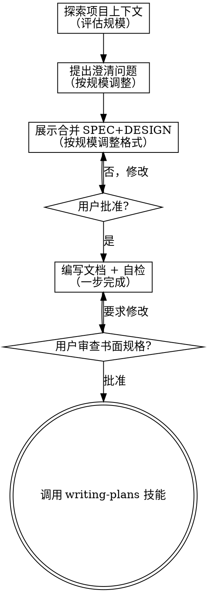

# 头脑风暴：将想法转化为设计

通过自然的协作对话，帮助将想法转化为完整的设计和规格说明。

首先了解当前项目的上下文，然后逐一提问来完善想法。一旦你理解了要构建的内容，就展示设计方案并获得用户批准。

<HARD-GATE>
在你展示设计方案并获得用户批准之前，不要调用任何实现技能、编写任何代码、搭建任何项目或采取任何实现行动。这适用于所有项目，无论看起来多简单。
</HARD-GATE>

## 反模式："这个太简单了，不需要设计"

每个项目都要经过这个流程。一个待办事项列表、一个单函数工具、一个配置变更——全都需要。"简单"的项目恰恰是未经检验的假设造成最多浪费的地方。设计可以很简短（对于真正简单的项目几句话就够了），但你必须展示出来并获得批准。区别在于详细程度，而非是否需要。

## 检查清单

你必须为以下每个条目创建任务，并按顺序完成：

1. **探索项目上下文** — 检查文件、文档、最近的 commit。评估项目规模（微型/标准/大型）并告知用户，确认评估结果。如果"过于庞大"（多个独立子系统），建议拆分。
2. **提出澄清问题** — 按规模调整数量和策略：
   - **微型**：0-1 个问题，可跳过直接进入设计
   - **标准**：2-4 个问题，每次最多 2 个
   - **大型**：按需提问，每次最多 2 个；范围过大则建议拆分
3. **展示合并的 SPEC+DESIGN** — 根据规模选择展示方式：
   - **微型**：简洁格式（目的+方案+验收，一段话级别）
   - **标准**：一次展示完整的 SPEC+DESIGN
   - **大型**：分 2-3 次展示（非逐节）
4. **编写文档并执行自检** — 写入 SPEC 和 DESIGN 文件、commit、自检、内联修复，在一个步骤内完成
5. **用户审查关卡** — 请用户审查 SPEC 和 DESIGN 文件
6. **过渡到实现** — 调用 writing-plans 技能

## 流程图

**终止状态是调用 writing-plans。** 不要调用任何其他实现技能。头脑风暴之后你唯一要调用的技能是 writing-plans。

## 流程详述

**理解想法（规模感知）：**

- 首先查看当前项目状态（探索与当前任务相关的代码、文档、最近的 commit）
- 探索完成后，评估变更规模：
  - **微型**：单文件变更、配置修改、单函数工具 — 几乎没有架构决策
  - **标准**：2-10 个文件的功能/组件 — 有部分设计决策
  - **大型**：多模块、多子系统 — 涉及重大架构决策和多个新概念
- 如果"过于庞大"（多个独立子系统），按现有逻辑帮助用户拆分为子项目，每个子项目独立走流程
- **提问策略：先想再问 + 批量提问**
  - 如果答案不会改变设计方向，用判断代替提问
  - 相关问题一起问（最多 2 个），不拆成多条消息
  - 按规模调整：微型 0-1 个问题（可跳过），标准 2-4 个，大型按需
  - 尽量使用选择题，开放式问题也可以
  - 重点理解：目的、约束、成功标准

**展示合并的 SPEC+DESIGN：**

将 SPEC（what）和 DESIGN（how）编织成一个连贯叙述，一次或分批展示给用户。展示时合并，保存时仍分离为两个文件。

根据规模选择展示格式：

- **微型格式**：目的一句话 + 方案 2-3 句 + 验收 2-3 条。整体展示，一次批准。
- **标准格式**：一次展示完整内容——目的、需求（RFC 2119 + GIVEN/WHEN/THEN）、技术方案、约束、验收标准、测试策略。一次批准。
- **大型格式**：分 2-3 次展示，每次是完整的一个"面"（如"核心功能+架构"、"边界场景+错误处理"、"测试策略+验收标准"），非逐节展示。

如果用户要求修改，修改后重新展示受影响的部分。获得完全批准后进入文档编写。

SPEC 仍使用 RFC 2119 关键词（SHALL/MUST/SHOULD）和 GIVEN/WHEN/THEN 场景格式。

每个部分的篇幅与其复杂度匹配：简单的几句话，复杂的最多 200-300 字。

**面向隔离和清晰的设计：**

- 将系统拆分为更小的单元，每个单元有一个明确的职责，通过定义良好的接口通信，可以独立理解和测试
- 对于每个单元，你应该能回答：它做什么，如何使用，它依赖什么？
- 别人能否不看内部实现就理解一个单元的功能？你能否在不影响调用者的情况下修改内部实现？如果不能，边界需要调整。
- 更小、边界清晰的单元也更便于你工作——你对能一次放入上下文的代码推理得更好，文件越专注你的编辑越可靠。当文件变大时，这通常意味着它承担了过多职责。

**在现有代码库中工作：**

- 在提出更改之前先探索现有结构。遵循现有模式。
- 如果现有代码存在影响当前工作的问题（例如文件过大、边界不清、职责纠缠），在设计中包含有针对性的改进——就像一个优秀的开发者在工作中改进经手的代码一样。
- 不要提议无关的重构。专注于服务当前目标的事情。

## 设计之后

**文档与自检（一步完成）：**

将展示时合并的 SPEC+DESIGN 拆分保存为两个独立文件，然后立即执行自检，全部在一个步骤内完成：

1. 将 SPEC 写入 `docs/superpowers/specs/YYYY-MM-DD-<topic>-spec.md`
2. 将 DESIGN 写入 `docs/superpowers/specs/YYYY-MM-DD-<topic>-design.md`
   - （用户对规格位置的偏好优先于此默认值）
3. 如果可用，使用 elements-of-style:writing-clearly-and-concisely 技能
4. 将文档 commit 到 git
5. 立即执行规格自检（见下方清单）
6. 发现问题直接内联修复，修复后重新 commit
7. 无需重新审查——修好继续推进

**规格自检清单：**
以全新的视角审视文档：

1. **占位符扫描：** 有没有"待定"、"TODO"、未完成的章节或模糊的需求？修复它们。
2. **内部一致性：** 各章节之间有矛盾吗？架构和功能描述匹配吗？
3. **范围检查：** 这是否聚焦到可以用一个实现计划覆盖，还是需要进一步拆分？
4. **模糊性检查：** 有没有需求可以被两种方式理解？如果有，选择一种并明确写出来。
5. **SPEC-DESIGN 一致性：** DESIGN 中的技术方案是否覆盖了 SPEC 中的所有需求？是否有 SPEC 中未提及的设计决策？

**用户审查关卡：**
规格自检完成后，请用户在继续之前审查书面规格：

> "SPEC 已写入 `<spec-path>`，DESIGN 已写入 `<design-path>`。请审查两个文件，如果在我们开始编写实现计划之前你想做任何修改，请告诉我。"

等待用户回复。如果他们要求修改，做出修改并重新运行规格自检。只有在用户批准后才继续。

**实现：**

- 调用 writing-plans 技能创建详细的实现计划
- 不要调用任何其他技能。writing-plans 是下一步。

## 核心原则

- **先想再问 + 批量提问** — 如果答案不会改变设计方向，用判断代替提问；相关的问题一起问（最多 2 个）
- **优先选择题** — 在可能的情况下比开放式问题更容易回答
- **严格遵循 YAGNI** — 从所有设计中移除不必要的功能
- **规模匹配详细度** — 微型项目用简洁格式，大型项目用完整格式，始终保持 HARD-GATE
- **保持灵活** — 有不明确的地方就回头澄清

